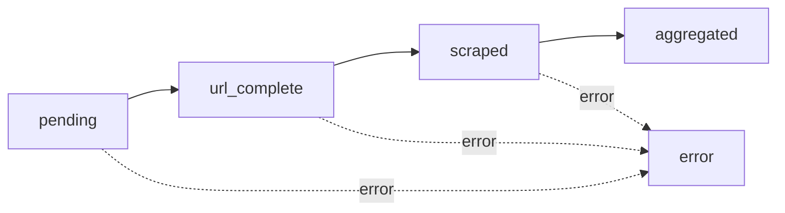

# LeadDesk 5 Workflows

## Overview
LeadDesk 5 uses n8n to orchestrate asynchronous batch processing through a dispatcher and three specialized worker workflows.


## Workflow Components

<CardGroup cols={2}>

<Card title="Dispatcher" icon="share-nodes" href="/workflows/dispatcher">
  Receives jobs and distributes practices to workers in batches
</Card>

<Card title="URL Worker" icon="link" href="/workflows/url-worker">
  Normalizes and validates practice URLs
</Card>

<Card title="Scraper Worker" icon="globe" href="/workflows/scraper-worker">
  Extracts practice data using OpenAI
</Card>

<Card title="Aggregator Worker" icon="layer-group" href="/workflows/aggregator-worker">
  Combines data and produces final enriched payload
</Card>

</CardGroup>

## Processing Flow

<Steps>
  <Step title="Job Creation">
    Frontend calls POST `/api/jobs` with CSV file
  </Step>
  
  <Step title="Dispatch">
    Backend triggers Dispatcher webhook with `job_id` and `practice_count`
  </Step>
  
  <Step title="Batching">
    Dispatcher chunks practices into groups of 10-25 and triggers URL Worker
  </Step>
  
  <Step title="URL Processing">
    URL Worker normalizes each practice URL and validates domains
  </Step>
  
  <Step title="Scraping">
    Scraper Worker fetches and extracts practice data using OpenAI
  </Step>
  
  <Step title="Aggregation">
    Aggregator Worker combines all payloads into final enriched data
  </Step>
  
  <Step title="Completion">
    Database triggers update job status to `completed`
  </Step>
</Steps>

## Status Transitions

Practice status flows through these states:



| Status | Description |
|--------|-------------|
| `pending` | Practice awaiting URL worker |
| `url_complete` | URL normalized and validated |
| `scraped` | Practice data extracted |
| `aggregated` | Final enrichment complete |
| `error` | Processing failed at any stage |

## Error Handling

All workers implement error handling:

- **Retry Logic**: Failed practices can be retried
- **Error Messages**: Detailed error info stored in `error_message` field
- **Failed Jobs Table**: Critical failures logged to `failed_jobs`
- **Job Status**: Any practice error can trigger job-level `failed` status

## Configuration

Workflow webhooks are configured via environment variables:

```bash
# Dispatcher
N8N_DISPATCHER_WEBHOOK=https://n8n.example.com/webhook/dispatcher

# Workers (called by dispatcher)
N8N_URL_WORKER_WEBHOOK=https://n8n.example.com/webhook/url-worker
N8N_SCRAPER_WEBHOOK=https://n8n.example.com/webhook/scraper
N8N_AGGREGATOR_WEBHOOK=https://n8n.example.com/webhook/aggregator
```

## Performance Considerations

- **Batch Size**: 10-25 practices per batch (configurable)
- **Concurrency**: Workers process batches in parallel
- **Rate Limiting**: Implement delays between scraping requests
- **Resource Usage**: Monitor n8n instance CPU/memory

## Next Steps

<CardGroup cols={2}>

<Card title="Dispatcher Setup" icon="share-nodes" href="/workflows/dispatcher">
  Configure the dispatcher workflow
</Card>

<Card title="URL Worker" icon="link" href="/workflows/url-worker">
  Set up URL normalization
</Card>

<Card title="Scraper Worker" icon="globe" href="/workflows/scraper-worker">
  Configure OpenAI scraping
</Card>

<Card title="Aggregator Worker" icon="layer-group" href="/workflows/aggregator-worker">
  Set up data aggregation
</Card>

</CardGroup>
